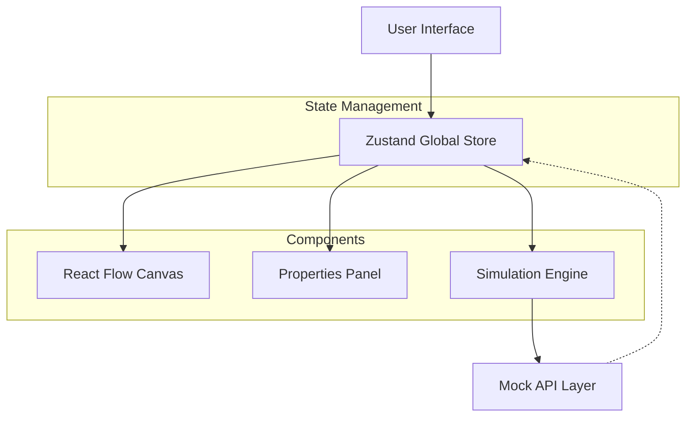

A premium, high-performance HR Workflow Automation builder. **ConnectHR** empowers HR administrators to design, simulate, and deploy complex organizational processes through an intuitive, drag-and-drop "Cyber-Glass" interface.

---
Live:   https://tredence-assignment-gamma.vercel.app/


## ✨ Key Features

### 🎨 Premium "Cyber-Glass" UI
*   **Immersive Design**: A state-of-the-art interface featuring glassmorphism, smooth micro-animations, and dynamic depth effects.
*   **High-Contrast Themes**: Professionally curated light and dark modes with a "Blueprint" aesthetic for clear workflow visualization.

### 🛠️ Advanced Workflow Canvas
*   **Intuitive Drag & Drop**: Powered by `reactflow`, allowing seamless node placement and connection.
*   **Smart Node Library**:
    *   🏁 **Start Node**: Entry point for every workflow.
    *   📝 **Task Node**: Assignable actions with detailed metadata.
    *   ⚖️ **Approval Node**: Branching logic for multi-stage decision making.
    *   🤖 **Automated Step**: Integration points for system-level actions.
    *   🏁 **End Node**: Defines the successful completion of a process.

### 🧪 Real-Time Simulation Sandbox
*   **Step-by-Step Execution**: Visualize the workflow logic path before deployment.
*   **Validation Engine**: Automatic detection of orphaned nodes, cycles, and missing start/end points.
*   **Execution Logs**: Real-time feedback on the status of each simulated step.

### 📊 Performance Dashboard
*   **Data Visualization**: High-level overview of workflow metrics and status.
*   **Search & Filter**: Effortlessly manage large libraries of automation templates.
*   **Workflow Lifecycle**: Create, duplicate, archive, and delete with instant visual feedback.

---

## 🛠️ Tech Stack

| Technology | Purpose |
| :--- | :--- |
| **React 19** | Core UI library for component-based architecture. |
| **React Flow** | Industrial-grade node-based canvas engine. |
| **Zustand** | Centralized state management with persistence. |
| **Vanilla CSS** | High-performance, bespoke styling with CSS Custom Properties. |
| **Lucide React** | Consistent, premium iconography. |
| **Vite** | Next-generation frontend tooling for lightning-fast builds. |

---

## 🏗️ Architecture

The project follows a modular, feature-based architecture designed for scalability and maintainability.

### System Flow Diagram



### 🧠 Simulation Engine Logic
The sandbox utilizes a custom traversal algorithm to validate and execute workflows:
- **Cycle Detection**: Prevents infinite loops by tracking visited nodes during traversal.
- **Path Validation**: Ensures every workflow starts with a `Start Node` and ideally terminates at an `End Node`.
- **Status Propagation**: Real-time status updates (`idle` → `processing` → `completed`) are pushed back to the nodes for visual feedback during simulation.
- **Async Mocking**: Simulated network latency and API responses via a Promise-based layer in `mockApi.js`.

### 🧩 Custom Node Library
Each node is a specialized React component providing unique functionality:
- **Start/End Nodes**: Optimized for entry and exit points with specific connection constraints.
- **Task & Approval Nodes**: Feature-rich configurations including assignment logic, priority levels, and branching paths.
- **Automated Steps**: Placeholder for third-party integrations (Email, Slack, Jira) with dynamic parameter mapping.

### 🔄 State Persistence & History
- **Zustand + Persist**: The entire workspace state (nodes, edges, settings) is automatically persisted to `localStorage`.
- **Undo/Redo System**: A custom history stack allows users to revert or replay any change on the canvas with standard keyboard shortcuts.

---

## 📁 Directory Structure

```text
src/
├── api/             # Mock API services (Simulate/Fetch)
├── components/      # Feature-specific components
│   ├── Canvas/      # Workflow builder & Custom Nodes
│   ├── Dashboard/   # Analytics & Workflow management
│   ├── Layout/      # Global navigation & Shell
│   ├── Sandbox/     # Simulation & Execution logs
│   └── Settings/    # App-wide configuration
├── store/           # Centralized Zustand stores
└── styles/          # Global tokens & Design System
```

---

## 🚀 Getting Started

### Prerequisites
*   Node.js (v18 or higher)
*   npm or yarn

### Installation

1.  **Clone the repository**
    ```bash
    git clone https://github.com/trisharaj11/hr-workflow-designer.git
    cd hr-workflow-designer
    ```

2.  **Install dependencies**
    ```bash
    npm install
    ```

3.  **Run in development mode**
    ```bash
    npm run dev
    ```

4.  **Build for production**
    ```bash
    npm run build
    ```

---

## 🧠 Design Philosophy

ConnectHR is built on the principle of **"Visual Intelligence"**. By abstracting complex HR logic into a visual node-based system, we bridge the gap between technical requirements and administrative ease.

*   **Reliability**: State is persisted across sessions, ensuring no work is lost.
*   **Flexibility**: The system is designed to be extensible, allowing for new node types and integration points.
*   **Performance**: Minimal re-renders through targeted Zustand state updates and optimized CSS transitions.

---

