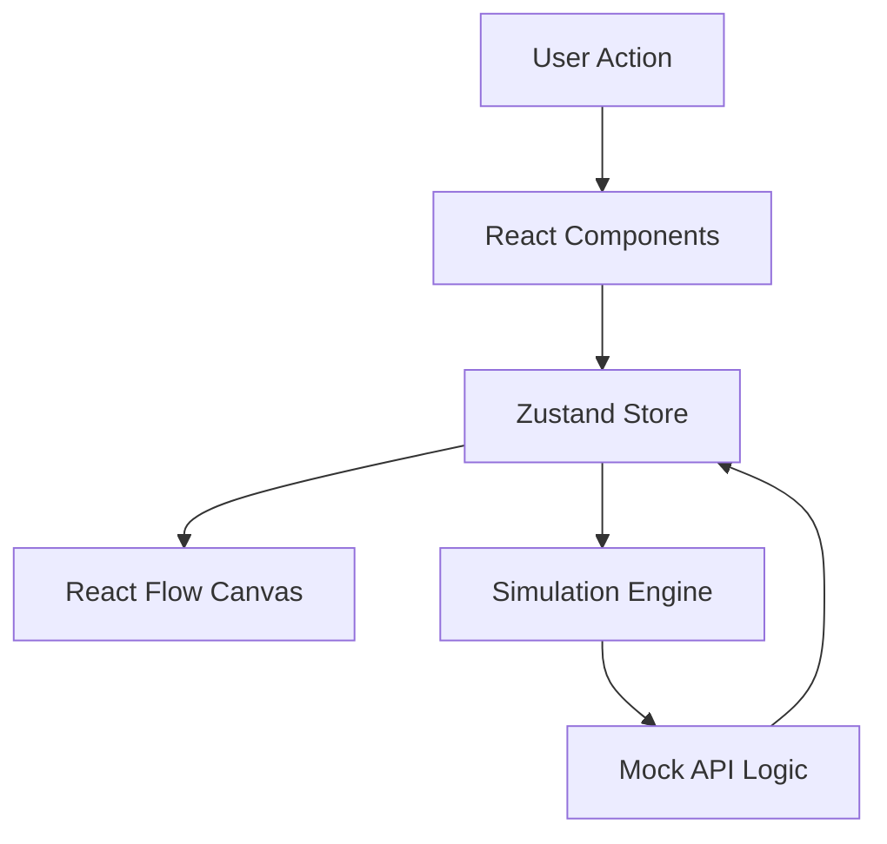

# 🚀 HR Workflow Designer

A modern, node-based workflow automation tool designed for HR processes like onboarding, approvals, and task management.
Users can visually design workflows using a drag-and-drop interface and simulate execution in real-time.

🔗 **Live Demo:** https://tredence-assignment-gamma.vercel.app/

---

## ✨ Features

### 🎨 Interactive UI

* Clean and modern **glassmorphism-based design**
* Light/Dark theme support
* Smooth animations and transitions

---

### 🧩 Workflow Builder (Core Feature)

* Drag & drop nodes on canvas
* Connect nodes to define process flow
* Multiple node types:

  * 🟢 Start Node
  * 📝 Task Node
  * ⚖️ Approval Node
  * 🤖 Automated Node
  * 🔴 End Node

---

### 🧪 Simulation Engine

* Run workflows before deployment
* Detect:

  * Missing Start/End nodes
  * Disconnected nodes
  * Invalid flows
* Shows step-by-step execution logs

---

### 📊 Dashboard

* View all workflows
* Create, delete, duplicate workflows
* Manage workflow lifecycle

---

### 💾 Persistence

* Automatically saves workflows using **localStorage**
* Data remains even after refresh

---

## 🛠️ Tech Stack

| Technology       | Why Used                                              |
| ---------------- | ----------------------------------------------------- |
| **React (Vite)** | Fast UI development with component-based architecture |
| **React Flow**   | Handles node graph, drag-drop, and connections        |
| **Zustand**      | Lightweight state management with minimal re-renders  |
| **Vanilla CSS**  | Full control over styling and performance             |
| **Lucide Icons** | Clean and consistent icons                            |

---

## 🔄 How It Works (Project Flow)


```mermaid
graph TD
    A[User Action] --> B[React Components]
    B --> C[Zustand Store]
    C --> D[React Flow Canvas]
    C --> E[Simulation Engine]
    E --> F[Mock API Logic]
    F --> C
```

### Flow Explanation:

1. User interacts with UI (drag node, connect nodes)
2. State updates in Zustand store
3. React Flow re-renders canvas
4. On simulation:

   * Workflow is validated
   * Graph is processed
   * Execution logs are generated

---

## 🧠 Core Concepts Used

* Graph-based workflow system (Nodes + Edges)
* State-driven UI rendering
* Topological traversal for execution flow
* Local persistence using browser storage

---

## 🚀 Getting Started

### 1. Clone Repository

```bash
git clone https://github.com/trisharaj11/tredence-assignment.git
cd tredence-assignment
```

### 2. Install Dependencies

```bash
npm install
```

### 3. Run Project

```bash
npm run dev
```

Open:

```
http://localhost:5173/
```

---

## 🎯 Key Highlights (For Interview)

* Built a **visual workflow engine** using graph-based logic
* Implemented **real-time simulation system**
* Used **Zustand for optimized state management**
* Designed scalable architecture without backend dependency

---

## 🧠 Design Thinking

This project focuses on simplifying complex HR processes into a **visual system**, making it easy for non-technical users to design workflows.

---

## 📌 Future Improvements

* Backend integration (Node.js / Firebase)
* Role-based access control
* Workflow versioning
* Real API integrations (Slack, Email)

---

## 👩‍💻 Author

**Trisha Raj**
